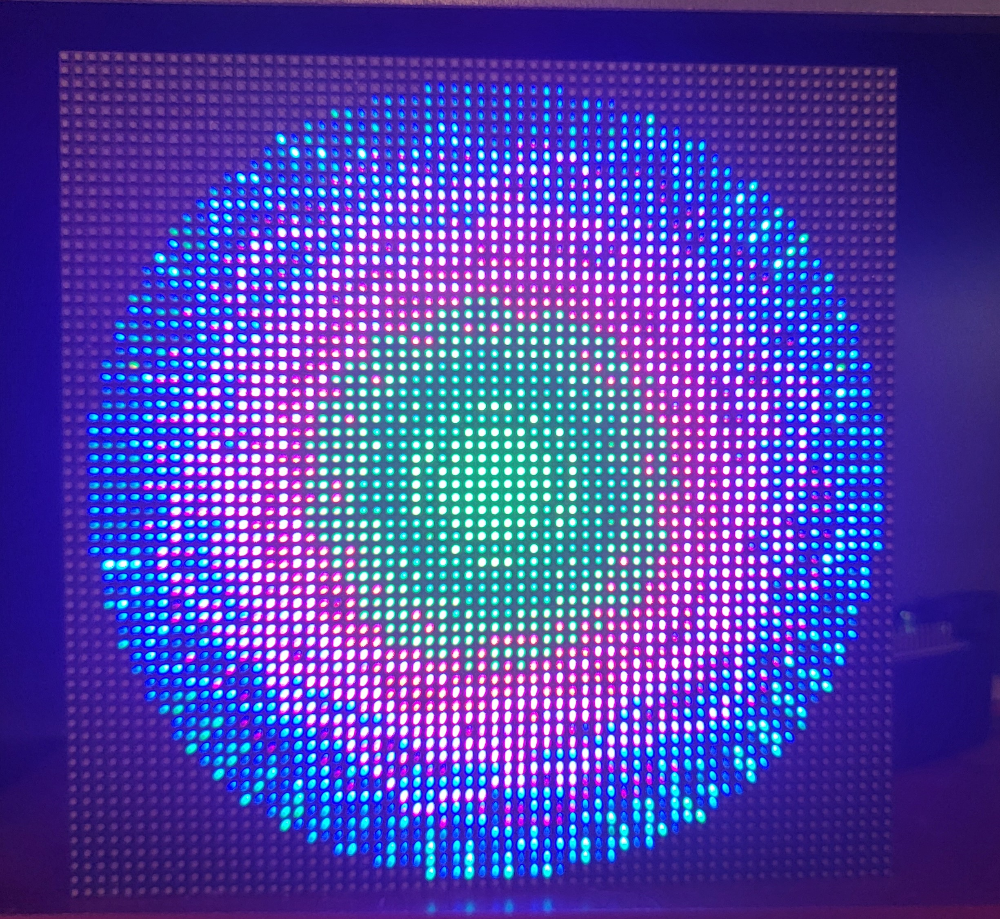
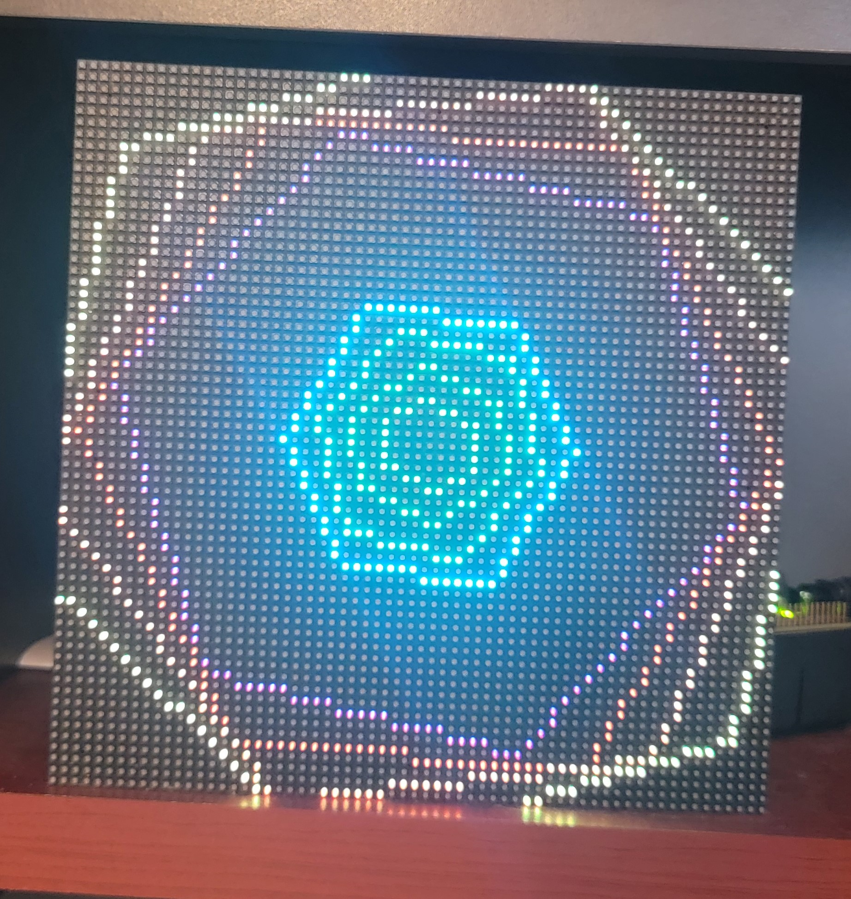
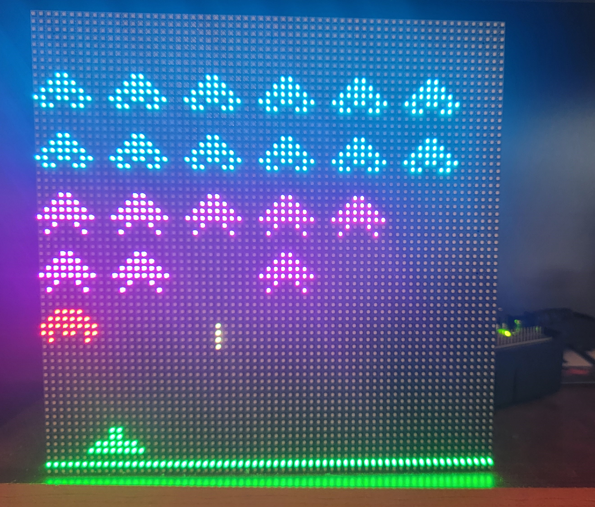
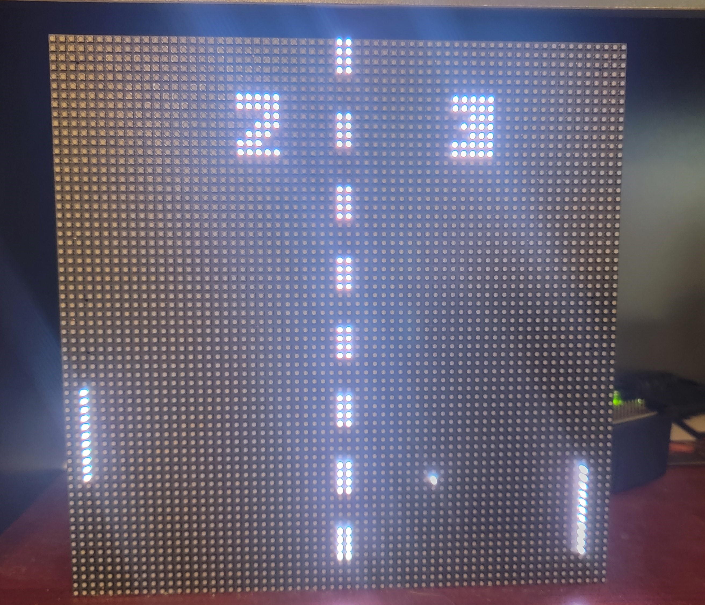

# Pixil LED Matrix

A Python-based scripting language for creating stunning animations on 64x64 RGB LED matrix displays with Raspberry Pi.

## Overview

Pixil is a custom scripting language designed to make creating animations and visualizations on RGB LED matrix displays easy, intuitive, and accessible. The language abstracts away the complexities of controlling LED matrices directly, providing simple commands for drawing, animation, and interactive content.



The project uses a producer/consumer architecture with a command queue to manage LED matrix operations, making it efficient for complex animations while maintaining synchronization when needed.

## AI Built

This project has been built entirely through AI collaboration. As a product owner by trade (not a developer), I created Pixil using incremental implementation by working with AI to make enhancements. The entire codebase has been developed through conversations with AI, primarily using Claude.ai and Grok 3.

All 125+ Pixil animation scripts were also created using the same approach. I provide the AI_Instructions.txt to AI, ask for animation ideas, and then collaborate to generate, test, and refine each script until the lightshow meets my expectations.

<div align="center">
  
</div>

## About This Project

Pixil is a custom Python-based framework designed to simplify creating vibrant animations on RGB LED matrices using a Raspberry Pi. It introduces a streamlined scripting language that makes LED programming accessible to creators of all skill levels.

The project was born from a desire to unlock the creative potential of LED matrices without requiring deep programming knowledge. Pixil abstracts away the complexities of direct hardware manipulation, letting you focus on your artistic vision through intuitive commands for shapes, text, sprites, and animations.

Featuring a producer/consumer architecture with command queuing, Pixil efficiently manages resources while maintaining smooth animations. The framework includes a JIT compiler for mathematical expressions, ensuring high performance even for computation-heavy scripts.



Whether you're building an interactive art installation, creating signage, or just exploring LED programming, Pixil provides both the simplicity beginners need and the power advanced users demand.

## Interest

If you find this project interesting or decide to use it, please reach out! I'd love to hear about your experience and see what you create with Pixil.

This entire project was created with AI. Since I am not a developer, I would love a developer's opinion of the solution. Is the code structured well? Readable? Properly designed using sensible coding structures?

## Getting Started

### Documentation

The easiest way to understand Pixil is to:

1. Read the [Installation Guide](docs/INSTALL.md) to set up your hardware
2. Look at example scripts in the `scripts/` directory
3. Use an AI assistant with the `docs/AI_Instructions.txt` file to generate custom scripts

For complete documentation:
- Use `docs/AI_Instructions.txt` with your favorite AI assistant and ask for a command reference
- The AI_Instructions.txt file is also human-readable but AI can create better examples and explanations

### Installation

For detailed installation instructions, see [INSTALL.md](docs/INSTALL.md).

Basic setup:
```bash
# Clone the repository
git clone https://github.com/kklasmeier/pixil-led-matrix.git
cd pixil-led-matrix

# Install dependencies
pip install -r requirements.txt

# Run a sample script
sudo python Pixil.py scripts/main/3D_perspective -q
```

### Running Scripts

```bash
# Run a single script
sudo python Pixil.py scripts/main/Aurora_Borealis

# Run all scripts in a directory with queue monitoring and 5-minute timer
sudo python Pixil.py scripts/main/* -q -t 5:00
```

Options:
- `-q` - Show the command queue depth (useful for performance monitoring)
- `-t 5:00` - Run each script for 5 minutes before moving to the next
- `-d DEBUG_LEVEL` - Set debug level (DEBUG_OFF, DEBUG_CONCISE, DEBUG_SUMMARY, DEBUG_VERBOSE)

## Features

### Core Features
- **Custom Scripting Language**: Designed specifically for LED matrix control
- **Simple Drawing Commands**: Lines, circles, rectangles, polygons, ellipses, arcs, and single pixels
- **Animation Framework**: Frame control with preserve mode for layered effects
- **Variables and Expressions**: Support for dynamic content with full math operations
- **Control Structures**: if/then/else/elseif, for loops, while loops
- **Arrays**: Support for numeric and string arrays with bounds checking
- **Math Functions**: Comprehensive set including trig, rounding, random, and more
- **Procedures**: Define reusable code blocks

### Sprite System
- **Multi-cel Animation**: Define sprites with multiple animation frames
- **Auto-advancing Cels**: Automatic frame cycling on move commands
- **Multiple Instances**: Show the same sprite multiple times with independent state
- **Z-index Support**: Control rendering order

### Background Layers
- **Scrollable Backgrounds**: Define backgrounds from sprites with seamless tiling
- **Multi-layer Support**: Stack multiple background layers with transparency
- **Animated Backgrounds**: Cycle through background cels for animated effects
- **Nudge and Offset**: Smooth scrolling with relative or absolute positioning

### Text Rendering
- **Multiple Effects**: Normal, Type, Scan, Slide, Dissolve, Wipe
- **Alignment Options**: Left, Center, Right alignment
- **Custom Fonts**: Support for bitmap fonts

### Performance Features
- **JIT Compilation**: Mathematical expressions compiled to bytecode for fast execution
- **Batch Plotting**: mplot/mflush commands for efficient multi-pixel operations
- **Burnout System**: Automatic pixel removal with instant or fade modes
- **Throttle Control**: Fine-tune animation speed and queue depth
- **Performance Metrics**: Built-in database for tracking script performance

<div align="center">
  
</div>

## Example Scripts

The project includes 125+ scripts demonstrating various animations and effects:

- **Visual Effects**: Aurora Borealis, Electric Arcs, Fireworks, Lightning, Plasma Ball
- **Animations**: Bouncing Ball, Digital Rain, Fireflies, Particle Fountain, Embers
- **Simulations**: Boids Flocking, Double Pendulum, Cloth Simulation, Spring Network
- **Physics**: Gravity Wells, Elastic Collision, Pendulum Wave, Dropped Ball
- **Games**: Breakout, Missile Command, Pong, Snake, Space Invaders, Tetris, Qix
- **Patterns**: Fractals, Spirograph, Kaleidoscope, Lissajous Curves, Voronoi
- **3D Effects**: Wormhole, 3D Perspective, Rotating Cube, RGB Color Cube
- **Nature**: Rain, Snowflake, Tornado, Fish Tank, Jellyfish, Fireflies
- **Optical Illusions**: Cafe Wall, Motion Blindness, Moire Patterns

## Language Reference

### Drawing Commands

```
draw_line(x1, y1, x2, y2, color, [intensity], [burnout], [burnout_mode])
plot(x, y, color, [intensity], [burnout], [burnout_mode])
draw_rectangle(x, y, width, height, color, [intensity], [filled], [burnout], [burnout_mode])
draw_circle(x, y, radius, color, [intensity], [filled], [burnout], [burnout_mode])
draw_polygon(x, y, radius, sides, color, [intensity], [rotation], [filled], [burnout], [burnout_mode])
draw_ellipse(x_center, y_center, x_radius, y_radius, color, [intensity], [fill], [rotation], [burnout], [burnout_mode])
draw_arc(x1, y1, x2, y2, bulge, color, [intensity], [filled], [burnout], [burnout_mode])
clear()
```

Burnout modes: `instant` (default) or `fade`

### Batch Plotting

```
mplot(x, y, color, [intensity], [burnout], [burnout_mode])
mplot(x2, y2, color, [intensity])
mflush()  # Send all queued pixels at once
```

### Variables and Expressions

```
v_x = 10
v_color = "red"
v_result = v_x * 2 + sin(v_angle)
v_random = random(0, 63, 0)  # Random integer 0-63
```

### Control Structures

```
if v_x > 10 then
    plot(v_x, v_y, red, 100)
elseif v_x > 5 then
    plot(v_x, v_y, yellow, 100)
else
    plot(v_x, v_y, green, 100)
endif

for v_i in (0, 10, 1)
    draw_circle(v_i * 5, 30, 3, blue, 100, true)
endfor v_i

while v_count < 5 then
    v_count = v_count + 1
endwhile
```

### Arrays

```
create_array(v_points, 10)           # Numeric array
create_array(v_colors, 5, string)    # String array

v_points[0] = 5
v_colors[0] = "red"
```

### Sprites with Animation Cels

```
define_sprite(pacman, 12, 12)
    sprite_cel(0)                    # Closed mouth
        draw_circle(6, 6, 5, yellow, 100, true)
    sprite_cel(1)                    # Open mouth
        draw_circle(6, 6, 5, yellow, 100, true)
        draw_polygon(11, 6, 4, 3, black, 100, 0, true)
endsprite

show_sprite(pacman, 10, 10, 0)       # Instance 0
move_sprite(pacman, 15, 10, 0)       # Auto-advances cel
hide_sprite(pacman, 0)
```

### Background Layers

```
define_sprite(stars, 128, 128)
    # Draw star pattern...
endsprite

set_background(stars)                # Activate on layer 0
nudge_background(1, 0)               # Scroll right, advance cel
set_background_offset(0, 0)          # Reset position
hide_background()                    # Hide layer
```

### Frame Control

```
begin_frame                          # Clear and buffer
    draw_circle(32, 32, 20, red, 100, true)
    draw_line(10, 10, 54, 54, yellow, 100)
end_frame                            # Display all at once

begin_frame(true)                    # Preserve existing content
    draw_circle(16, 16, 5, blue, 100, true)
end_frame
```

### Text Commands

```
draw_text(10, 20, "Hello", tiny64_font, 12, white, 75)
draw_text(32, 30, "SCORE", tiny64_font, 12, yellow, 100, NORMAL, CENTER)
draw_text(10, 40, "Loading...", tiny64_font, 12, cyan, 100, TYPE, SLOW)
clear_text(10, 20)
```

### Performance Commands

```
sync_queue          # Wait for all queued commands to complete
throttle(0.5)       # Adjust command timing (0.5 = faster, 2.0 = slower)
rest(0.1)           # Pause script execution for 0.1 seconds
```

## Project Structure

```
/
├── Pixil.py                 # Main script interpreter
├── README.md                # Project documentation
├── requirement.txt          # Python dependencies
│
├── pixil_utils/             # Script parsing and utilities
│   ├── expression_parser.py # Variable and math expression handling
│   ├── math_functions.py    # Math operations and evaluation
│   ├── array_manager.py     # Array handling with bounds checking
│   ├── jit_compiler/        # JIT compilation for expressions
│   └── ...
│
├── rgb_matrix_lib/          # LED matrix interface
│   ├── api.py               # Main hardware interface
│   ├── sprite.py            # Sprite system with multi-cel support
│   ├── background.py        # Background layer system
│   ├── drawing_objects.py   # Shape drawing and burnout
│   ├── text_renderer.py     # Text with effects
│   └── ...
│
├── shared/                  # Inter-process communication
│   ├── command_queue.py     # Producer/consumer queue
│   └── ...
│
├── database/                # Performance metrics
│   └── ...
│
├── scripts/                 # Pixil animation scripts
│   ├── main/                # 125+ ready-to-run animations
│   └── testing/             # Test scripts
│
└── docs/                    # Documentation
    ├── AI_Instructions.txt  # Complete language reference for AI
    └── INSTALL.md           # Hardware setup guide
```

## License

This project is licensed under the MIT License - see the [LICENSE](LICENSE) file for details.

## Acknowledgments

- Special thanks to the [rpi-rgb-led-matrix](https://github.com/hzeller/rpi-rgb-led-matrix) library by Henner Zeller
- Inspired by various LED art projects in the maker community
- Thanks to the Adafruit team for their RGB Matrix Bonnet and installation scripts
