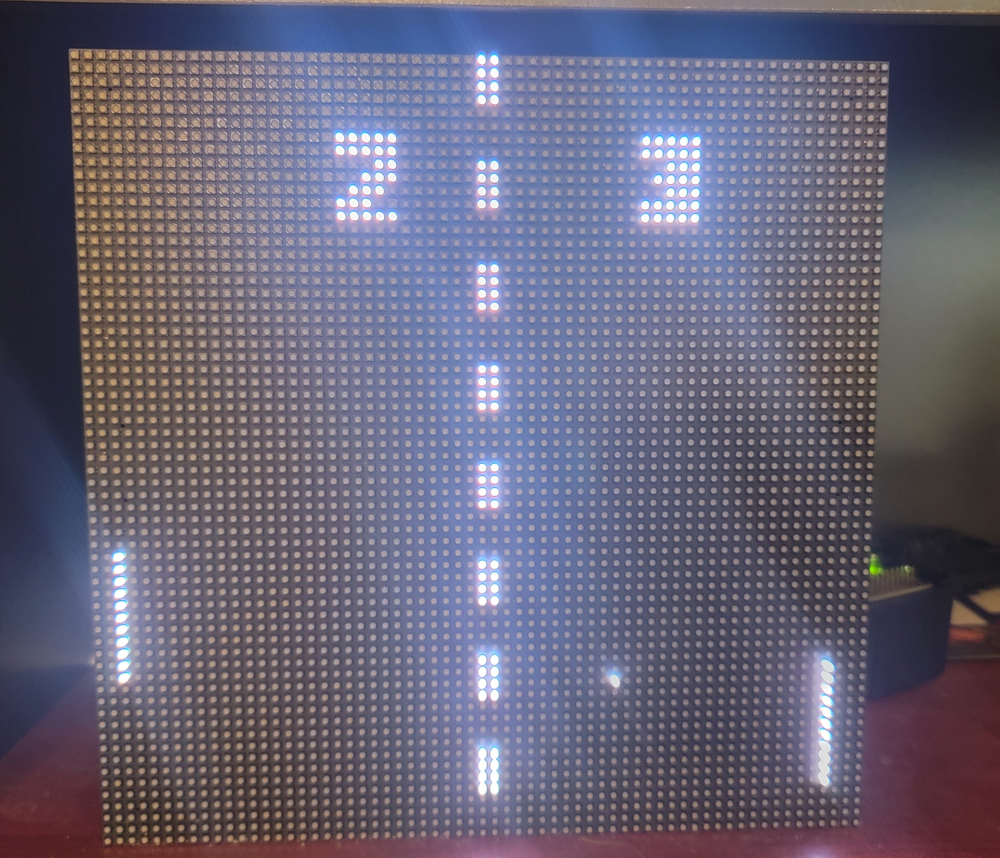

# Pixil LED Matrix

A Python-based scripting language for creating stunning animations on 64x64 RGB LED matrix displays with Raspberry Pi.

## Overview

Pixil is a custom scripting language designed to make creating animations and visualizations on RGB LED matrix displays easy, intuitive, and accessible. The language abstracts away the complexities of controlling LED matrices directly, providing simple commands for drawing, animation, and interactive content.


The project uses a producer/consumer architecture with a command queue to manage LED matrix operations, making it efficient for complex animations while maintaining synchronization when needed.

## AI Built

This project has been built entirely through AI collaboration. As a product owner by trade (not a developer), I created Pixil using incremental implementation by working with AI to make enhancements. The entire codebase has been developed through conversations with AI, primarily using Claude.ai and Grok 3.

All 75+ Pixil animation scripts were also created using the same approach. I simply provide the AI_Instructions.txt to AI, ask for animation ideas, and then collaborate to generate, test, and refine each script until the lightshow meets my expectations.

<div align="center">
  
</div>

## About this project

Pixil is a custom Python-based framework designed to simplify creating vibrant animations on RGB LED matrices using a Raspberry Pi. It introduces a streamlined scripting language that makes LED programming accessible to creators of all skill levels.

The project was born from a desire to unlock the creative potential of LED matrices without requiring deep programming knowledge. Pixil abstracts away the complexities of direct hardware manipulation, letting you focus on your artistic vision through intuitive commands for shapes, text, sprites, and animations.

Featuring a producer/consumer architecture with command queuing, Pixil efficiently manages resources while maintaining smooth animations. The framework comes with 75+ ready-to-use scripts demonstrating various effects from simple bouncing balls to complex particle simulations and classic arcade games.


Whether you're building an interactive art installation, creating signage, or just exploring LED programming, Pixil provides both the simplicity beginners need and the power advanced users demand.

## Interest

If you find this project interesting or decide to use it, please reach out! I'd love to hear about your experience and see what you create with Pixil.

This entire project was created from AI. Since I am not a develoepr, i would like a deverlop opinion of solution. Is the code strucutred well? Readable? Properly designed using sensable coding structures?

## Getting Started

### Documentation

The easiest way to understand Pixil is to:

1. Read the [Installation Guide](docs/INSTALL.md) to set up your hardware
2. Look at example scripts in the `scripts/` directory
3. Use an AI assistant with the `docs/AI_Instructions.txt` file to generate custom scripts

For complete documentation:
- Use `docs/AI_Instructions.txt` with your favorite AI assistant and ask for a command reference
- The AI_Instructions.txt file is also human-readable but AI can create better examples and explanations. Give AI Pixil.py for even more detail.

### Installation

For detailed installation instructions, see [INSTALL.md](docs/INSTALL.md).

Basic setup:
```bash
# Clone the repository
git clone https://github.com/kklasmeier/pixil-led-matrix.git
cd pixil-led-matrix

# Install dependencies
pip install -r requirements.txt

# Run a sample script
sudo python Pixil.py scripts/3D_perspective -q
```

### Running Scripts

```bash
# Run a single script
sudo python Pixil.py scripts/3D_perspective

# Run all scripts in a directory with queue monitoring and 5-minute timer
sudo python Pixil.py scripts/* -q -t 5:00
```

Options:
- `-q` - Show the command queue depth (useful for performance monitoring)
- `-t 5:00` - Run each script for 5 minutes before moving to the next
- `-d DEBUG_LEVEL` - Set debug level (DEBUG_OFF, DEBUG_CONCISE, DEBUG_SUMMARY, DEBUG_VERBOSE)

## Features

- **Custom Scripting Language**: Designed specifically for LED matrix control
- **Simple Drawing Commands**: Lines, circles, rectangles, polygons, and single pixels
- **Animation Framework**: Frame control and automatic "burnout" effects
- **Variables and Expressions**: Support for dynamic content with math operations
- **Control Structures**: if/then/else, for loops, while loops
- **Arrays**: Support for numeric and string arrays
- **Math Functions**: Comprehensive set of math operations
- **Sprites**: Create reusable objects that can be instantiated multiple times
- **Text Rendering**: Display text with multiple effects (type, scan, slide, dissolve, wipe)
- **Color Control**: Named colors and intensity customization
- **Procedures**: Define reusable code blocks
- **Performance Controls**: Throttle and sync_queue commands for animation tuning

<div align="center">
  
</div>

## Example Scripts

The project includes 75+ scripts demonstrating various animations and effects:

- **Visual Effects**: Aurora Borealis, Electric Arcs, Fireworks, Lightning
- **Animations**: Bouncing Ball, Digital Rain, Fireflies, Particle Fountain
- **Simulations**: Boids Flocking, Solar System, Swarm, Gravity Wells
- **Games**: Missile Command, Pong, Snake, Space Invaders
- **Patterns**: Fractals, Spirograph, Kaleidoscope, Lissajous Curves
- **3D Effects**: Wormhole, 3D Perspective, Psychedelic Tunnel

## Language Reference

### Drawing Commands

```
draw_line(x1, y1, x2, y2, color, intensity, duration)
plot(x, y, color, intensity, duration)
draw_rectangle(x, y, width, height, color, intensity, filled, duration)
draw_circle(x, y, radius, color, intensity, filled, duration)
clear()
draw_polygon(x, y, radius, sides, color, intensity, rotation, filled, duration)
```

### Variables and Expressions

```
v_x = 10
v_color = "red"
v_result = v_x * 2 + 5
```

### Control Structures

```
if v_x > 10 then
    plot(v_x, v_y, red, 100)
endif

for v_i in (0, 10, 1) then
    draw_circle(v_i * 5, 30, 3, blue, 100, true)
endfor v_i

v_count = 0
while v_count < 5 then
    draw_line(0, v_count * 10, 63, v_count * 10, green, 100)
    v_count = v_count + 1
endwhile
```

### Arrays

```
create_array(v_points, 10)
v_points[0] = 5
v_points[1] = 10

create_array(v_colors, 5, string)
v_colors[0] = "red"
v_colors[1] = "blue"
```

### Sprites

```
define_sprite(ball, 10, 10)
    draw_circle(5, 5, 4, red, 100, true)
endsprite

show_sprite(ball, 20, 30)
move_sprite(ball, 25, 35)
hide_sprite(ball)
```

### Frame Control

```
begin_frame
    draw_circle(32, 32, 20, red, 100, true)
    draw_line(10, 10, 54, 54, yellow, 100)
end_frame
```

### Text Commands

```
draw_text(10, 20, "Hello World", piboto-regular, 12, white, 75, SLIDE, LEFT)
clear_text(10, 20)
```

## Project Structure

- **Pixil.py**: Main script interpreter - Parses and executes Pixil script commands
- **pixil_utils/**: Utility functions for parsing, math operations, and script management
- **rgb_matrix_lib/**: LED matrix interface and drawing operations
- **shared/**: Queue system for command execution
- **scripts/**: Example Pixil scripts demonstrating various animations

## License

This project is licensed under the MIT License - see the [LICENSE](LICENSE) file for details.

## Acknowledgments

- Special thanks to the [rpi-rgb-led-matrix](https://github.com/hzeller/rpi-rgb-led-matrix) library by Henner Zeller
- Inspired by various LED art projects in the maker community
- Thanks to the Adafruit team for their RGB Matrix Bonnet and installation scripts